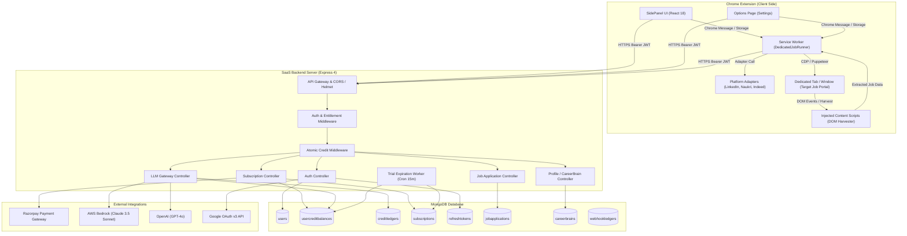
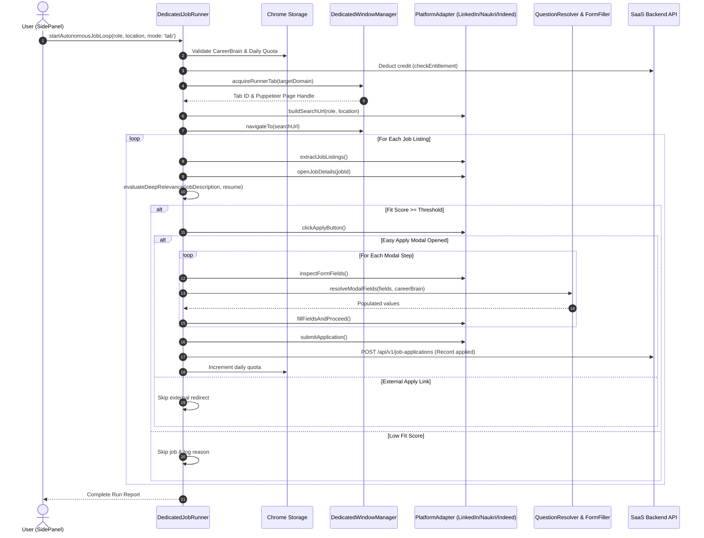

# System Architecture & Technical Design

## 1. System Overview
NanoBrowser (marketed as JobPilot / AI Agent Browser) is an enterprise-grade, autonomous web browsing and job application platform. It combines a client-side **Google Chrome Extension (Manifest V3)** with a high-performance **Node.js/Express SaaS Backend** and a multi-provider **AI/LLM Gateway**.

The primary commercial capability of the system is autonomous, high-accuracy job discovery and one-click application submission across premier professional portals (**LinkedIn Easy Apply**, **Naukri Fast Forward**, and **Indeed Instant Apply**). The system eliminates manual job searching and repetitive screening questionnaire entry by employing a hybrid intelligence architecture: local rule-based heuristics combined with remote LLM reasoning and semantic vector matching over candidate resumes.

```
+--------------------------------------------------------------------------------------------------+
|                                    CLIENT (Google Chrome MV3)                                    |
|                                                                                                  |
|  +---------------------------+   +---------------------------+   +----------------------------+  |
|  |     Chrome SidePanel      |   |       Options Page        |   |    Content Script Layer    |  |
|  |  (React 18 / TailwindCSS) |   |  (React 18 / TailwindCSS) |   | (DOM Harvester / Applier)  |  |
|  +-------------+-------------+   +-------------+-------------+   +--------------+-------------+  |
|                |                               |                                |                |
|                +-----------------------+-------+--------------------------------+                |
|                                        |                                                         |
|                                        v                                                         |
|  +--------------------------------------------------------------------------------------------+  |
|  |                     Chrome Service Worker (Background Process / Agent Core)                |  |
|  |                                                                                            |  |
|  |  +-------------------------+  +--------------------------+  +---------------------------+  |  |
|  |  |   DedicatedJobRunner    |  |  General Agent Executor  |  |      BrowserContext       |  |  |
|  |  | (LinkedIn/Naukri/Indeed)|  |    (Planner / Navigator) |  |   (CDP / Puppeteer Core)  |  |  |
|  |  +------------+------------+  +-------------+------------+  +-------------+-------------+  |  |
|  +---------------|-----------------------------|-----------------------------|----------------+  |
+------------------|-----------------------------|-----------------------------|-------------------+
                   |                             |                             |
                   | REST API (Bearer JWT)       | Managed LLM / Quota Sync    | Target Portals
                   v                             v                             v
+-------------------------------------------------------------+   +--------------------------------+
|                   SAAS BACKEND (Node.js / Express 4)         |   |    PORTALS (DOM / Session)     |
|                                                             |   |                                |
|  - Correlation ID & Helmet Security Headers                 |   |  - https://www.linkedin.com    |
|  - JWT Authentication & Refresh Token Rotation              |   |  - https://www.naukri.com      |
|  - Dual Entitlement & Atomic Credit Ledger (Mongoose)       |   |  - https://www.indeed.com      |
|  - Razorpay Subscription & Webhook Ingestion Engine         |   +--------------------------------+
|  - Managed LLM Gateway (AWS Bedrock Claude 3.5 / OpenAI)    |
|  - Resume Parsing & CareerBrain Extraction Engine           |
|  - Background Worker: Trial Expiration Cron (15-min)        |
+------------------------------+------------------------------+
                               |
                               v
+-------------------------------------------------------------+
|                      DATA PERSISTENCE                        |
|                                                             |
|  - MongoDB (Mongoose 8.7)                                   |
|    Collections: users, usercreditbalances, creditledgers,   |
|                 subscriptions, plans, refreshtokens,        |
|                 webhookledgers, llmusagelogs,               |
|                 jobapplications, careerbrains               |
+-------------------------------------------------------------+
```

---

## 2. Monorepo Organization & Workspace Topology
The codebase is structured as a **PNPM Workspace** monorepo managed by **Turborepo** (`turbo.json`).

```
nanobrowser/
├── backend/                       # Express 4 SaaS backend application
│   ├── src/
│   │   ├── config/                # Environment schemas (Zod) and MongoDB initialization
│   │   ├── controllers/           # HTTP Request handlers
│   │   ├── middleware/            # Auth, rate limiting, credit check, correlation ID
│   │   ├── models/                # 10 Mongoose schemas & data contracts
│   │   ├── routes/                # Express v1 route definitions
│   │   ├── schemas/               # Zod input validation schemas
│   │   ├── services/              # Core business services & LLM provider abstraction
│   │   ├── utils/                 # Logging, API response envelopes, PDF builders
│   │   └── workers/               # Background cron workers (Trial expiration)
│   ├── tsconfig.json
│   └── vitest.config.ts
├── chrome-extension/              # Manifest V3 extension core
│   ├── manifest.ts                # Chrome extension manifest builder
│   ├── src/
│   │   └── background/
│   │       ├── agent/             # Autonomous agent, planner, navigator, adapters
│   │       ├── browser/           # Puppeteer/CDP browser page abstractions
│   │       ├── services/          # Analytics, guardrails, speech-to-text
│   │       └── task/              # Task lifecycle manager
│   ├── tsconfig.json
│   └── vite.config.mts
├── pages/                         # UI Surfaces (React 18 / Vite / TailwindCSS)
│   ├── content/                   # Content scripts injected into candidate tabs
│   ├── options/                   # Settings, billing, analytics, and prompt dashboards
│   └── side-panel/                # Side panel UI: chat, job dashboard, profile setup
└── packages/                      # Shared libraries consumed across monorepo
    ├── dev-utils/                 # Build logging & manifest validation
    ├── hmr/                       # Hot module reloading for Chrome extensions
    ├── i18n/                      # Internationalization translation tables
    ├── schema-utils/              # JSON schema converters
    ├── shared/                    # API client, config, hooks, semantic matchers
    ├── storage/                   # Typed Chrome Storage Local abstractions
    ├── tailwind-config/           # Unified Tailwind theme configuration
    ├── tsconfig/                  # Base TypeScript configurations
    ├── ui/                        # Shared React UI primitives
    ├── vite-config/               # Shared Vite build configs
    └── zipper/                    # Extension bundle packager for deployment
```

---

## 3. High-Level Architecture Diagram



---

## 4. Frontend -> Backend Communication
1. **Transport**: Pure HTTPS JSON REST communication using the shared `backendApiClient` in `packages/shared/lib/backend-api-client.ts`.
2. **Correlation & Tracing**: Every outbound request carries:
   - `Authorization: Bearer <accessToken>`
   - `x-correlation-id`: Generated UUID for distributed request tracing.
   - `x-run-id`: Agent run identifier to enable run-specific logging and failure credit refunds.
   - `x-idempotency-key`: Unique operation key ensuring retry-safe operations on financial, LLM, and deduction endpoints.
3. **Token Management**: The client stores access and refresh tokens inside Chrome Local Storage via `authStorage` (`packages/storage/lib/auth/authStorage.ts`). When an access token expires (HTTP 401 `TOKEN_EXPIRED`), the `backendApiClient` automatically attempts a refresh call to `/api/v1/auth/refresh`. If successful, the failed request is replayed transparently; if failed, session is invalidated.

---

## 5. Backend -> Database Architecture
1. **Object Relational Mapping**: Mongoose 8.7.0 connected to MongoDB with automatic index creation and connection pooling.
2. **Atomic Credit Concurrency Guard**:
   - The platform avoids race conditions during parallel LLM requests or job submissions by leveraging MongoDB atomic atomic operators (`$inc`, `$set`) conditioned on available balance:
     ```typescript
     UserCreditBalance.findOneAndUpdate(
       { userId, remainingCredits: { $gte: amount } },
       { $inc: { usedCredits: amount, remainingCredits: -amount } },
       { new: true }
     );
     ```
   - If `remainingCredits < amount`, the query returns `null`, triggering an immediate HTTP 402 `INSUFFICIENT_CREDITS` without touching the ledger.
3. **Transaction Support**: Where MongoDB replica sets are active, multi-document ACID transactions (`mongoose.startSession()`) ensure atomic user creation + trial provisioning + credit allocation. When operating on standalone MongoDB instances, automated compensating rollback mechanisms trigger.

---

## 6. Browser Extension Automation Loop
The extension operates a sophisticated automation engine capable of running in either a **dedicated pop-up window** or a **dedicated active tab** within the user's browser window.



---

## 7. Storage Layers & Dual State Synchronization
State is partitioned into two distinct persistence layers:
1. **Chrome Storage Local (`chrome.storage.local`)**:
   - High-speed, local client storage accessible to background service workers, content scripts, and side panel React views without network latency.
   - Holds: `careerBrain` cache, `processedJobs` (already applied URLs/IDs), `runnerState` (active run status, current step, counters), `linkedInConfig` (target role, daily limit, easy-apply only flag), and `authStorage` (JWT tokens).
2. **MongoDB Backend**:
   - Central system of record for commercial subscriptions, user identity, immutable financial ledger entries, metered LLM logs, and cross-device job application histories.
   - **Synchronization Flow**: On SidePanel load or resume upload, `ProfileService.syncProfile` pushes local CareerBrain data to MongoDB. Conversely, on initial login, the extension fetches `/api/v1/profile` and hydrates `chrome.storage.local`.
