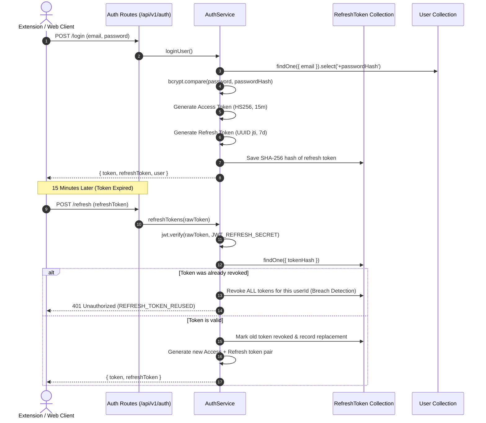

# Authentication & Authorization Architecture

> Website sign-in / sign-out sync with JobForm Automator, token refresh and account isolation: see [JOBFORM_WEBSITE_SESSION.md](./JOBFORM_WEBSITE_SESSION.md).

## 1. Authentication Mechanisms
The application employs a secure, stateless **JWT (JSON Web Token)** architecture with cryptographically hashed, rotating refresh tokens and Google OAuth v3 integration.

---

## 2. Password Handling & Security
- Passwords are encrypted using **bcryptjs** with a cost factor of **12** (`bcrypt.hash(password, 12)`).
- `passwordHash` field has `select: false` on the Mongoose schema, preventing inadvertent exposure in API responses.
- Login failures return a generic error: `"Invalid email or password"` (Code: `INVALID_CREDENTIALS`) to eliminate account enumeration vectors.

---

## 3. Refresh Token Rotation & Breach Detection
- Every refresh operation issues a brand new access token AND a new refresh token.
- The previous refresh token is marked with `revokedAt = new Date()` and `replacedByTokenHash`.
- If an attacker uses an already-revoked refresh token, the server immediately triggers **Reuse Detection**: all tokens belonging to that `userId` are instantly invalidated, requiring the legitimate user to log in again.
- Expired tokens are purged automatically by MongoDB using a TTL index (`expiresAt: { expires: 0 }`).

---

## 4. Authorization & RBAC
- **Roles**:
  - `user`: Standard account. Allowed to manage own profile, run jobs within quota, checkout plans.
  - `admin`: Elevated role. Access to administrative overrides and metrics.
- **Middleware**:
  - `authenticate` (`backend/src/middleware/auth.middleware.ts`): Validates Bearer token, decodes `sub` (userId) and `role`.
  - `checkEntitlement` (`backend/src/middleware/entitlement.middleware.ts`): Ensures user has status `ACTIVE` or `TRIALING` before accessing premium features.
