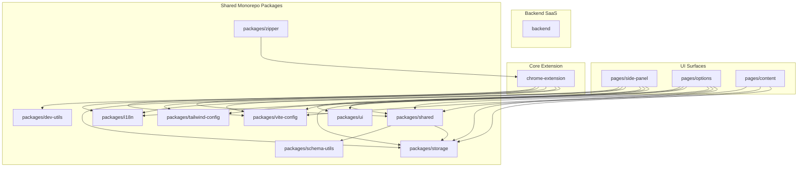

# Monorepo Dependency Graph & Architecture Trees

## 1. Package Dependency Graph

```mermaid
flowchart TD
    subgraph UI_Surfaces["UI Surfaces"]
        SidePanel["pages/side-panel"]
        Options["pages/options"]
        Content["pages/content"]
    end

    subgraph Core["Core Extension"]
        Ext["chrome-extension"]
    end

    subgraph Backend_App["Backend SaaS"]
        Backend["backend"]
    end

    subgraph Shared_Pkgs["Shared Monorepo Packages"]
        Storage["packages/storage"]
        Shared["packages/shared"]
        UI["packages/ui"]
        I18n["packages/i18n"]
        SchemaUtils["packages/schema-utils"]
        DevUtils["packages/dev-utils"]
        ViteConfig["packages/vite-config"]
        TailwindConfig["packages/tailwind-config"]
        Zipper["packages/zipper"]
    end

    SidePanel --> Storage
    SidePanel --> Shared
    SidePanel --> UI
    SidePanel --> I18n

    Options --> Storage
    Options --> Shared
    Options --> UI
    Options --> I18n

    Content --> Storage
    Content --> Shared

    Ext --> Storage
    Ext --> Shared
    Ext --> I18n
    Ext --> DevUtils

    Shared --> Storage
    Shared --> SchemaUtils

    SidePanel --> ViteConfig
    Options --> ViteConfig
    Content --> ViteConfig
    Ext --> ViteConfig

    SidePanel --> TailwindConfig
    Options --> TailwindConfig

    Zipper --> Ext
```
