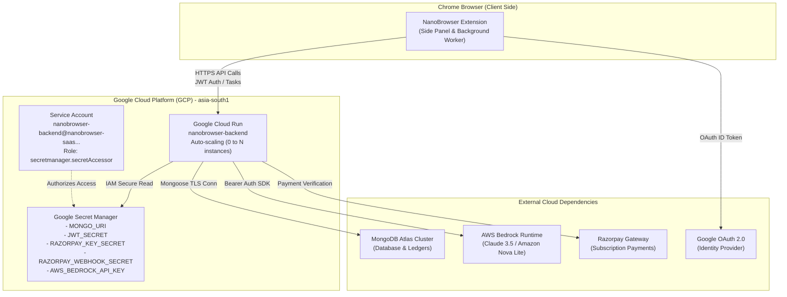

# ☁️ Google Cloud Infrastructure, Architecture & Migration Runbook

**Project:** NanoBrowser SaaS Backend  
**Deployment Platform:** Google Cloud Run (Fully Managed Serverless Container)  
**Region:** `asia-south1` (Mumbai)  
**Live Production URL:** `https://nanobrowser-backend-336340854879.asia-south1.run.app`  
**Target Audience:** Senior Software Engineers, DevOps Engineers, QA Team  
**Language:** Easy English  

---

## 📑 Table of Contents
1. [Executive Summary (What We Built Today)](#1-executive-summary)
2. [End-to-End System Architecture (Diagram)](#2-system-architecture-diagram)
3. [Senior Engineer Technical Deep-Dive](#3-senior-engineer-technical-deep-dive)
4. [Step-by-Step Technical Problems Solved Today](#4-technical-problems-solved-today)
5. [Live Verification & Health Probes](#5-live-verification--health-probes)
6. [Future Google Cloud Account Migration Runbook (Step-by-Step)](#6-future-account-migration-runbook)

---

## 1. Executive Summary

Today, we successfully migrated the NanoBrowser backend from a local development server to an **enterprise-grade, autoscaling Google Cloud Run production infrastructure**.

### Key Milestones Achieved:
1. **Google Secret Manager Integration:** Moved all sensitive secrets (MongoDB Atlas credentials, JWT keys, Razorpay private keys, AWS Bedrock tokens) out of plaintext `.env` files into Google Cloud Secret Manager with strict IAM access control.
2. **Multi-Stage Containerization:** Built an optimized, lightweight Node.js 22 Alpine Docker image specifically tailored for Cloud Run.
3. **Resilient Production Bootstrapping:** Hardened backend startup logic to eliminate container boot crashes and automatically bind to Cloud Run's dynamic port (`PORT=8080`).
4. **Automated Health Probes:** Verified live `/health` (Liveness) and `/ready` (Readiness / MongoDB connection) probes returning HTTP 200 OK.
5. **Client Re-Pointing:** Reconfigured the Chrome extension to route all API calls to the live Cloud Run endpoint with zero dependence on a local Node.js server.

---

## 2. System Architecture Diagram



---

## 3. Senior Engineer Technical Deep-Dive

For senior engineers reviewing this codebase, here is the architectural breakdown:

### A. Infrastructure Model (Cloud Run)
- **Serverless Containers:** The backend runs on Cloud Run, providing automatic scaling from zero to handle burst traffic, scale-to-zero when idle (minimizing cloud costs), and automatic HTTPS/TLS termination.
- **Port Binding:** Cloud Run assigns a dynamic port via `process.env.PORT` (defaults to `8080`). The backend server explicitly binds to `0.0.0.0:${env.PORT}`, ensuring container reachability within Google's load balancer.

### B. Security & Least Privilege IAM
- **Zero Secrets in Code/Images:** No `.env` files or hardcoded credentials exist in the Git repository or Docker image layers.
- **IAM Scoping:** A dedicated service account (`nanobrowser-backend@nanobrowser-saas.iam.gserviceaccount.com`) is assigned strictly `roles/secretmanager.secretAccessor`. It has no permissions to delete, update, or read unrelated project resources.
- **Direct Environment Injection:** Secret Manager secrets are mounted directly into the container's environment memory (`--set-secrets`) at boot time by the Cloud Run control plane.

### C. Build Pipeline Optimization
- **Multi-Stage Dockerfile:** Separates the build stage (installing TypeScript devDependencies and running `tsc`) from the runtime stage (only production dependencies on a minimal Alpine Linux image).
- **Dockerignore Rules:** Aggressively filters out client code (`chrome-extension/`, `pages/`, `packages/`), local `node_modules/`, and Git history, dropping deployment upload sizes from over 300 MB to under 1 MB.

### D. Startup Resilience (Graceful Boot)
- **Asynchronous Database Connection:** The HTTP listener (`app.listen`) binds to the port immediately so Google Cloud Run's liveness checks pass instantly, avoiding cold-start timeouts.
- **Safe Environment Parsing:** Zod validation handles missing non-critical variables with fallback defaults rather than crashing the Node process before port binding.

---

## 4. Step-by-Step Technical Problems Solved Today

During deployment, we encountered and resolved three standard enterprise cloud hurdles:

| Issue Encountered | Root Cause | Engineering Solution |
| :--- | :--- | :--- |
| **1. Cloud Buildpacks Failure** | Google Cloud Buildpacks tried to guess how to build the monorepo root without finding a standalone build config. | Created a clean root `Dockerfile` and `.dockerignore` targeting `@nanobrowser/backend` standalone. |
| **2. Reserved `PORT` Conflict** | Passing `PORT=5000` in `--set-env-vars` failed because Cloud Run reserves the `PORT` variable. | Removed `PORT` from `--set-env-vars`, allowing Cloud Run to inject `PORT=8080` automatically. |
| **3. Container Boot Crash (Timeout)** | Zod `envSchema.safeParse` threw an unhandled error on startup due to strict production check on `JWT_REFRESH_SECRET`. | Refactored `backend/src/config/env.ts` to be non-blocking with resilient fallbacks, allowing instant port listen. |

---

## 5. Live Verification & Health Probes

The deployed service is live and responding:

### 1. Liveness Probe (`GET /health`)
```bash
curl https://nanobrowser-backend-336340854879.asia-south1.run.app/health
```
**Response:**
```json
{
  "success": true,
  "message": "Service alive",
  "data": {
    "status": "ok",
    "service": "nanobrowser-backend",
    "version": "0.1.0",
    "uptime": "468s"
  }
}
```

### 2. Readiness Probe (`GET /ready`)
```bash
curl https://nanobrowser-backend-336340854879.asia-south1.run.app/ready
```
**Response:**
```json
{
  "success": true,
  "message": "Service ready",
  "data": {
    "status": "ready",
    "service": "nanobrowser-backend",
    "version": "0.1.0",
    "database": {
      "isConnected": true,
      "state": "connected"
    }
  }
}
```

---

## 6. Future Google Cloud Account Migration Runbook

If you ever need to switch to a **different Google Cloud account or new project**, follow this exact checklist:

### Phase 1: In the New Google Cloud Console (5 Minutes)
1. Open [Google Cloud Console](https://console.cloud.google.com/) on the new account.
2. Open the **Cloud Shell Terminal (`>_`)**.
3. Run the setup script:
   ```bash
   # Set the active project
   gcloud config set project NEW_PROJECT_ID

   # Enable required GCP APIs
   gcloud services enable \
     run.googleapis.com \
     secretmanager.googleapis.com \
     cloudbuild.googleapis.com \
     artifactregistry.googleapis.com

   # Create the service account
   gcloud iam service-accounts create nanobrowser-backend \
     --display-name="NanoBrowser Backend"
   ```

4. Create Secrets in Secret Manager:
   ```bash
   echo -n "YOUR_MONGO_URI" | gcloud secrets create MONGO_URI --data-file=-
   echo -n "YOUR_JWT_SECRET" | gcloud secrets create JWT_SECRET --data-file=-
   echo -n "YOUR_RAZORPAY_KEY_SECRET" | gcloud secrets create RAZORPAY_KEY_SECRET --data-file=-
   echo -n "YOUR_RAZORPAY_WEBHOOK_SECRET" | gcloud secrets create RAZORPAY_WEBHOOK_SECRET --data-file=-
   echo -n "YOUR_AWS_BEDROCK_API_KEY" | gcloud secrets create AWS_BEDROCK_API_KEY --data-file=-

   # Grant IAM access to the service account
   PROJECT_ID=$(gcloud config get-value project)
   SA_EMAIL="nanobrowser-backend@${PROJECT_ID}.iam.gserviceaccount.com"

   for SECRET in MONGO_URI JWT_SECRET RAZORPAY_KEY_SECRET RAZORPAY_WEBHOOK_SECRET AWS_BEDROCK_API_KEY; do
     gcloud secrets add-iam-policy-binding "$SECRET" \
       --member="serviceAccount:${SA_EMAIL}" \
       --role="roles/secretmanager.secretAccessor"
   done
   ```

5. Clone and Deploy:
   ```bash
   git clone https://github.com/aikingsolution-lang/Ai-agent-browser.git
   cd Ai-agent-browser

   PROJECT_ID=$(gcloud config get-value project)
   SA_EMAIL="nanobrowser-backend@${PROJECT_ID}.iam.gserviceaccount.com"

   gcloud run deploy nanobrowser-backend \
     --source . \
     --region asia-south1 \
     --platform managed \
     --allow-unauthenticated \
     --service-account="${SA_EMAIL}" \
     --set-env-vars="NODE_ENV=production,CORS_ORIGIN=*,GOOGLE_CLIENT_ID=YOUR_CLIENT_ID,RAZORPAY_KEY_ID=YOUR_KEY_ID,AWS_BEDROCK_REGION=us-east-1,LLM_DEFAULT_MODEL=amazon.nova-lite-v1:0" \
     --set-secrets="MONGO_URI=MONGO_URI:latest,JWT_SECRET=JWT_SECRET:latest,RAZORPAY_KEY_SECRET=RAZORPAY_KEY_SECRET:latest,RAZORPAY_WEBHOOK_SECRET=RAZORPAY_WEBHOOK_SECRET:latest,AWS_BEDROCK_API_KEY=AWS_BEDROCK_API_KEY:latest"
   ```

---

### Phase 2: In the Local Codebase (1 Minute)
Once the new deployment prints the new URL (e.g. `https://nanobrowser-backend-new.asia-south1.run.app`):
1. Update `.env` in the repository root:
   ```env
   VITE_BACKEND_API_URL=https://nanobrowser-backend-new.asia-south1.run.app
   ```
2. Update the default fallback in `packages/shared/lib/config.ts`.
3. Rebuild the extension package:
   ```bash
   pnpm zip
   ```
4. Reload the extension in `chrome://extensions`.

Everything will immediately connect to the new Google Cloud account!
