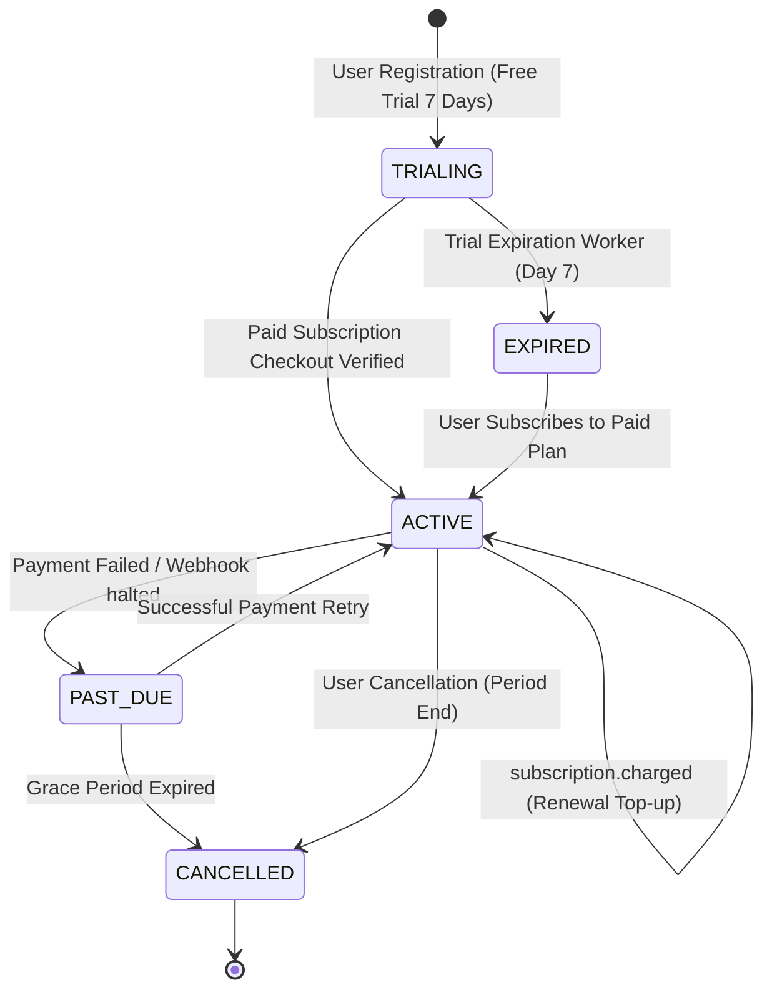

# Payment & Subscription Architecture (Razorpay)

## 1. Monetization Model
The platform operates on a freemium SaaS model with commercial billing powered by **Razorpay**:
- **Free Trial**: 7 days, 50 credits, 10 job applications/day limit.
- **Pro Monthly** (`pro-monthly`): ₹999 / month (or equivalent), 500 credits/period, 100 job applications/day limit.
- **Enterprise** (`enterprise-monthly`): Unlimited / customized credits, priority queueing.

---

## 2. Subscription State Machine
Subscriptions transition through states defined in `backend/src/models/subscription.model.ts`:



---

## 3. Webhook Ingestion Engine (`backend/src/services/subscriptionLifecycle.service.ts`)
- **Endpoint**: `POST /api/v1/webhooks/razorpay`
- **Signature Verification**:
  - Uses `express.raw({ type: 'application/json' })` to capture the exact raw binary Buffer.
  - Verifies HMAC-SHA256 signature against `RAZORPAY_WEBHOOK_SECRET`:
    ```typescript
    crypto.createHmac('sha256', secret).update(rawBody).digest('hex') === signatureHeader;
    ```
- **Idempotency & Reclaim Lock**:
  - Inserts event into `WebhookLedger` with status `'PROCESSING'`.
  - Duplicate events return `200 OK` immediately with `isDuplicate: true`.
  - Stuck events (> 2 minutes in `'PROCESSING'`) are safely reclaimed and reprocessed.
- **Stale Event Protection**:
  - Rejects out-of-order events using `subscription.lastEventTimestamp`.

---

## 4. Background Trial Expiration Worker (`backend/src/workers/trialExpiration.worker.ts`)
- Runs every **15 minutes** (`*/15 * * * *`) via `node-cron`.
- Queries:
  ```typescript
  Subscription.find({
    status: 'TRIALING',
    isTrial: true,
    trialEndDate: { $lt: new Date() }
  });
  ```
- Sets status to `EXPIRED`, resets remaining credits, and demotes user daily quota to 0.
